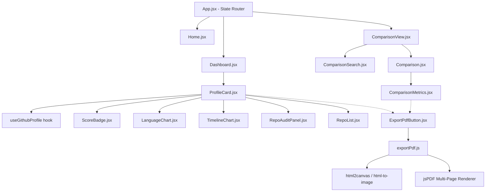
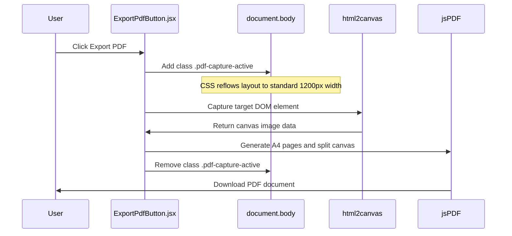

# 🏗️ Architecture Guide

This document outlines the codebase architecture, state management, custom hook integration, and technical mechanics of the **GitHub Profile Analyzer & Comparer**.

---

## 1. High-Level Flow

The application is structured as a **stateless, client-only Single Page Application (SPA)** that interacts directly with the public GitHub REST API. 

---

## 2. Core Architectural Layers

### A. Routing & State Management (`App.jsx`)
Because the app is designed to be lightweight, it avoids heavy client-side router packages (like `react-router-dom`). Instead, it uses a **state-based router**:
* `mode`: Controls which view is active (`home`, `analyzer`, or `comparison`).
* `comparisonUsernames`: Passes target usernames to the comparison page.
* Navigations are animated using `framer-motion`'s `<AnimatePresence>` for seamless page transitions.

### B. Data Fetching & State Hooks (`src/hooks/`)
Data orchestration and utility behaviors are abstracted into custom hooks:
1. **`useGithubProfile(username)`**:
   * Fetches profile data from `https://api.github.com/users/{username}`.
   * Fetches up to 200 public repositories using the `repos` sub-endpoint.
   * Handles request loading and error boundaries (e.g. "User not found").
2. **`useExportableAvatarSrc(avatarUrl)`**:
   * *Critical for PDF generation.* In HTML5 Canvas rendering, drawing cross-origin images (like GitHub avatars hosted on `githubusercontent.com`) taints the canvas, preventing PDF export.
   * This hook fetches the avatar image via an Ajax request with `mode: 'cors'`, converts it into a local Base64 data URL, and passes it to the UI, enabling taint-free exporting.
3. **`useTheme()`**:
   * Syncs theme state (`light` or `dark`) with local storage and system media queries.

### C. PDF Generation Pipeline (`src/utils/exportPdf.js`)
The PDF export feature renders high-resolution reports directly from the DOM using a custom rendering pipeline:

* **Layout Reflow**: When the user clicks export, the application injects a `.pdf-capture-active` class. This temporarily locks elements into print-friendly dimensions (e.g., forcing a 1200px column layout, wrapping charts, and hiding UI toggles like the Star button).
* **Multi-Page Splitting**: The canvas is split mathematically into sections matching A4 dimensions (`210mm x 297mm`) and pushed sequentially onto the PDF pages to avoid cutting text or charts in half.

---

## 3. Custom Algorithms

### A. Developer Score Formula
The application calculates a developer score that rewards community size, repo activity, and project reception:

$$\text{Developer Score} = (\text{Total Stars} \times 2) + \text{Total Forks} + \text{Followers} + (\text{Active Original Repos} \times 3)$$

* **Score Tiers**:
  * **`> 500`**: Expert (Green Badge)
  * **`> 200`**: Advanced (Blue Badge)
  * **`<= 200`**: Beginner (Gray Badge)

### B. Developer Persona Classifier
Determines developer specialties based on primary programming language distributions in public repositories:
* **Frontend Architect**: Dominant language is `JavaScript`, `TypeScript`, `HTML`, or `CSS`.
* **Systems Architect**: Dominant language is `Go`, `Rust`, `C++`, `C`, or `Java`.
* **Data Scientist / AI Dev**: Dominant language is `Python`, `R`, `Julia`, or `Jupyter Notebook`.
* **Backend Specialist**: Dominant language is `PHP` or `Ruby`.
* **DevOps Engineer**: Dominant language is `Shell` or `PowerShell`.
