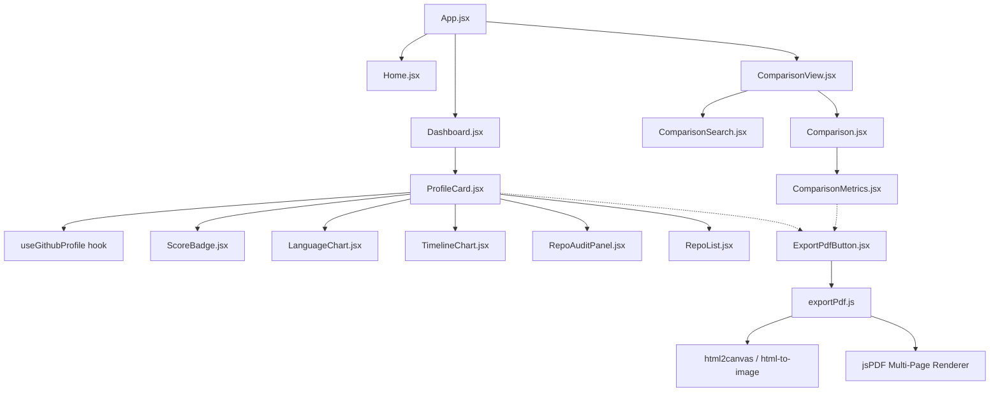

# 🚀 GitHub Profile Analyzer & Comparer

A professional, high-fidelity **React & Vite-based developer analytics dashboard** that inspects GitHub profiles, performs deep metrics analysis, and allows real-time side-by-side profile comparisons. It features fully polished custom PDF generation and export capabilities.

[](https://react.dev)
[](https://vitejs.dev)
[](https://recharts.org)
[](#)
[](#)

---

## 📸 Preview

### Dashboard Overview


### 📊 Analyzer Mode
Detailed breakdown of user stats, repositories, and languages.


### 🆚 Comparison Mode
Compare two GitHub profiles side-by-side to see who has more contributions, followers, and better stats.


### 📥 Download Mode
Download single profile or two-profile comparisons as custom-paginated PDFs.


---

## 🏗️ System Architecture

The project is structured under an active Single Page Application (SPA) architecture utilizing custom hooks for data orchestration, Recharts for data visualizations, and standard HTML5/CSS3 glassmorphic design variables.



### Component Breakdown & Data Flow
1. **React State Router (`App.jsx`)**: Manages navigation routing between `home`, `analyzer`, and `comparison` modes, wrapped with `framer-motion`'s `AnimatePresence` for smooth transition animations.
2. **Profile Orchestrator (`ProfileCard.jsx`)**: Calls the `useGithubProfile` React Hook, computes advanced dev statistics, classifies the user, and coordinates layout components.
3. **Analytics Visualization Layer**:
   * **Language Analyzer (`LanguageChart.jsx`)**: Renders language distribution via a Recharts Donut PieChart and custom CSS progress percentages.
   * **Audit Panel (`RepoAuditPanel.jsx`)**: Evaluates repository compliance rates, documentation coverage, and open-source licensing.
   * **Timeline Panel (`TimelineChart.jsx`)**: Generates repository creation history over calendar years using a Recharts BarChart.
4. **Interactive Repositories List (`RepoList.jsx`)**: Employs client-side search indexing and multi-criteria sorting (Stars, Forks, Size, Last Updated) with custom pagination controls.
5. **PDF Engine (`exportPdf.js` / `ExportPdfButton.jsx`)**: Captures DOM structures dynamically under custom styles (applying `.pdf-capture-active` to format layouts into 1200px printing blocks), generates raw canvases using CORS proxies, and processes multi-page pagination outputs using `jsPDF`.

---

## 🧮 Custom Algorithms

### 1. Developer Score Formula
The application calculates a customized developer score reflecting repository popularity, active engagement, and community size:

$$\text{Developer Score} = (\text{Total Stars} \times 2) + \text{Total Forks} + \text{Followers} + (\text{Active Original Repos} \times 3)$$

#### Score Tiers:
* **`> 1000`**: OSS Legend (Red Badge)
* **`> 500`**: Elite Developer (Green Badge)
* **`> 200`**: Rising Star (Blue Badge)
* **`> 50`**: Active Contributor (Yellow Badge)
* **`<= 50`**: GitHub Enthusiast (Gray Badge)

### 2. Developer Persona Classifier
Determines developer specialties based on primary programming language distributions in their public repositories:
* **Frontend Architect**: Dominant language in `JavaScript`, `TypeScript`, `HTML`, `CSS`.
* **Systems Architect**: Dominant language in `Go`, `Rust`, `C++`, `C`, `Java`.
* **Data Scientist / AI Dev**: Dominant language in `Python`, `R`, `Julia`, `Jupyter Notebook`.
* **Backend Specialist**: Dominant language in `PHP`, `Ruby`.
* **DevOps Engineer**: Dominant language in `Shell`, `PowerShell`.

---

## ✨ Features

- 🔍 **Search & Index**: Look up any public GitHub developer with immediate error boundaries and skeleton loaders.
- 📊 **Language Diagnostics**: Interactive pie charts accompanied by progress bars indicating code percentages.
- 📈 **Creation Timeline**: Year-over-year project creation chart detailing developer activity history.
- 🛡️ **Repo Quality Audit**: Automated calculation of original projects, readme documentation rate, licensing rate, and homepage deployments.
- ⚙️ **Interactive Repo Search**: Live filtering, sorting, and pagination of user repositories.
- 🆚 **Side-by-Side Comparison**: Complete statistical analysis matching two developers across repositories, followers, stars, forks, and final developer scores.
- 📥 **Clean PDF Exporting**: Layout translation to standard formats for high-resolution A4 multi-page document downloads.

---

## 🛠 Tech Stack

* **Frontend Framework**: React 19 (Vite compilation)
* **Data Visualization**: Recharts (SVG-based charting)
* **PDF Processing**: html2canvas, html-to-image, jsPDF (multi-page styling and CORS handling)
* **Animation**: Framer Motion
* **Styling**: Vanilla CSS3 (Custom variables, dark/light theme systems, responsive flex/grid layouts)
* **Data Layer**: GitHub REST API v3

---

## ▶️ Getting Started

### Prerequisites
* Node.js (v18.0.0 or higher)
* npm

### Installation
1. Clone the repository:
   ```bash
   git clone https://github.com/sameer9860/github-profile-analyzer.git
   ```
2. Navigate to the project directory:
   ```bash
   cd Github-Profile-Analyzer/github-profile-analyzer
   ```
3. Install project dependencies:
   ```bash
   npm install
   ```

### Running Locally
To launch the developer server:
```bash
npm run dev
```
Open your browser and navigate to `http://localhost:5173`.

### Production Build
To build and bundle the project for production:
```bash
npm run build
```

---

*Built with ❤️ using React & Recharts*
