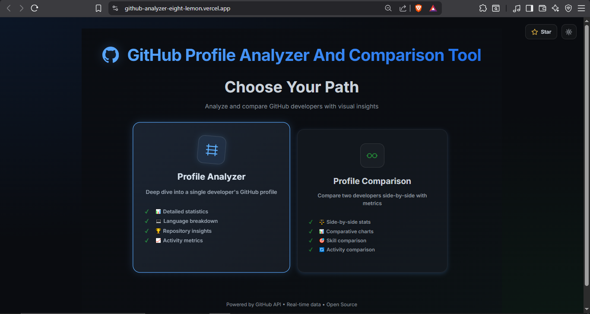
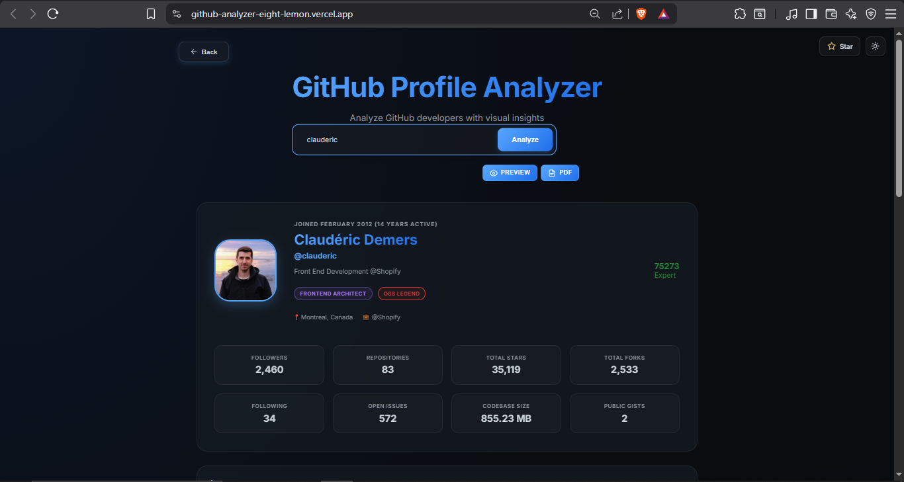
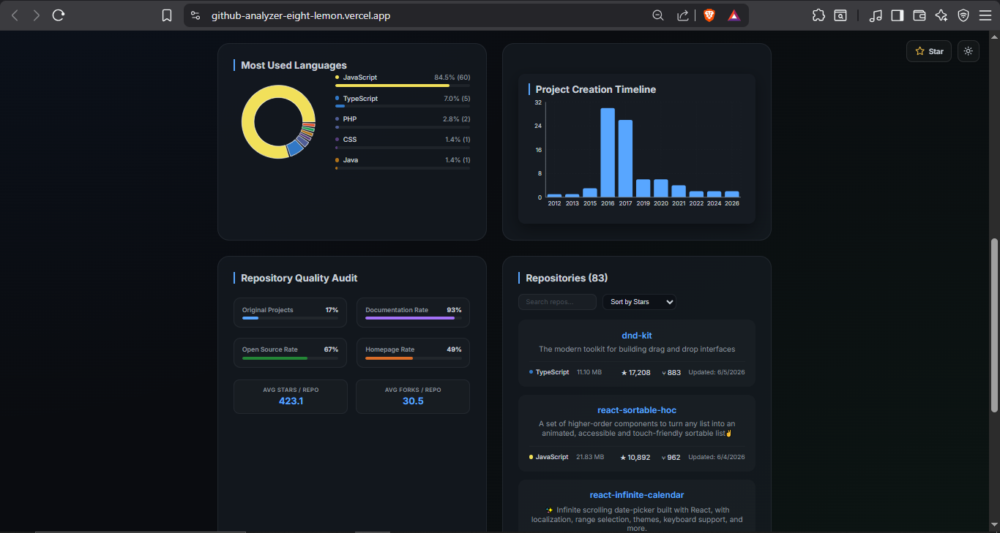
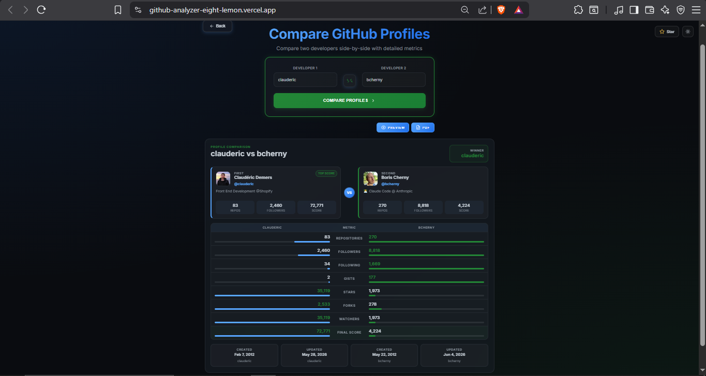

# 🚀 GitHub Profile Analyzer & Comparer

A professional, high-fidelity **React & Vite-based developer analytics dashboard** that inspects GitHub profiles, performs deep metrics analysis, and allows real-time side-by-side profile comparisons. It features fully polished custom PDF generation and export capabilities.

[](https://react.dev)
[](https://vitejs.dev)
[](https://recharts.org)
[](LICENSE)

---

## 📸 Preview

### 🏠 Homepage


### 📊 Profile Analysis
<table width="100%">
  <tr>
    <td width="50%">
      
    </td>
    <td width="50%">
      
    </td>
  </tr>
</table>

### 🆚 Profile Comparison
Compare two GitHub profiles side-by-side:


---

## 🏗️ System Documentation

To support open-source contributions and maintainability, the project includes structured guides for developers:

- **[ARCHITECTURE.md](ARCHITECTURE.md)**: Details the design patterns, React hooks, data flow, and PDF generation pipeline.
- **[CONTRIBUTING.md](CONTRIBUTING.md)**: Outlines workspace setup, linting rules, code conventions, and pull request procedures.
- **[ROADMAP.md](ROADMAP.md)**: Highlights future milestones and features planned for the platform.

---

## 💡 What Works Today

- **Direct Profile Search**: Instant lookup of any public GitHub developer with clean loading skeletons and error boundaries.
- **Developer Score calculation**: Custom rating algorithms based on public repo counts, forks, stars, and follower counts.
- **Repository Quality Audit**: Automated calculation of originality rates, documentation coverage, license availability, and homepage deployment rates.
- **Interactive Data Visualizations**:
  - **Language Diagnostics**: Recharts-based interactive Donut PieChart and custom CSS progress percentages.
  - **Activity Timeline**: Year-over-year project creation activity charts.
- **Side-by-Side Comparison**: Comprehensive side-by-side metrics comparing two developers across stars, forks, and final scores.
- **A4 PDF Exporting**: Clean multi-page PDF generation via CORS-friendly canvas capturing for developer summaries.
- **Responsive Theme Engine**: Light/Dark theme switching utilizing global CSS custom properties.

---

## 🛠️ Stack & Technologies

* **Frontend Framework**: React 19 (compiled with `rolldown-vite` / Vite)
* **Data Visualization**: Recharts (SVG-based charts)
* **PDF Compilation**: html2canvas, html-to-image, jsPDF
* **Animation**: Framer Motion
* **Styling**: Vanilla CSS3 (glassmorphic layout variables, grid/flex structures)
* **Data Layer**: GitHub REST API v3 (unauthenticated public endpoints)

---

## 🚀 Getting Started

### Prerequisites
* Node.js (v18.0.0 or higher)
* npm

### Local Setup
1. Clone the repository:
   ```bash
   git clone https://github.com/Sandipxg/Github_analyzer.git
   cd Github_analyzer
   ```
2. Install dependencies:
   ```bash
   npm install
   ```
3. Run the development server:
   ```bash
   npm run dev
   ```
   Open `http://localhost:5173` in your browser.

4. Build for production:
   ```bash
   npm run build
   ```

---

## ⚠️ Current Caveats

- **GitHub API Rate Limits**: Unauthenticated clients are restricted by GitHub to a default rate limit of 60 requests per hour.
- **CORS Avatar Capture**: Profile pictures from GitHub are processed through a CORS canvas fetcher (`useExportableAvatarSrc`) to prevent image tainting on exported PDFs. If the client cannot connect to GitHub's avatar subdomain, avatars will fall back to placeholders in downloads.
- **State Router**: The application uses a React state router (`mode === "home" | "analyzer" | "comparison"`), meaning the browser's back/forward buttons will not navigate between views.

---

*Built with ❤️ using React & Recharts*
